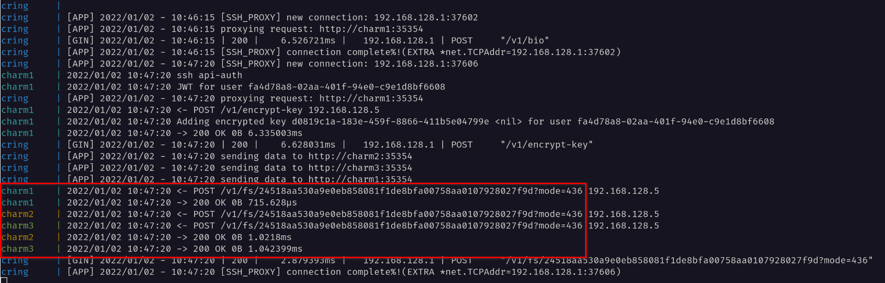

# Charmed 💍 Ring

A smart TCP proxy to replicate and backup [Charm FS](https://charm.sh) files.

## Overview

Charmed Ring is an HTTP/SSH proxy that acts as a Charm server and replicates files uploaded with `charm fs` to a number (two or more) of backend Charm servers.

The proxy uses [consistent hashing](https://github.com/buraksezer/consistent) to replicate data among a number of configured servers.

## Status

Charmed Ring is currently a working prototype. Using the proxy to replicate important data is highly discouraged at the moment. Most of the work to measure performance, reliability and correctness still needs to happen.
The proxy should not interfere with other Charm functionality (KV, linking, etc), but it hasn't been tested extensively.

From a security point of view, the proxy is stateless, and no JTW token manipulation happens when the HTTP requests traverse the proxy, so it should be relatively safe. SSH proxying happens at the TCP level, simply forwarding what the proxy receives from the client to the first configured Charm backend. Work to understand the security implications of having a proxy sitting between a Charm client and a server still needs to happen.

Besides the fairly immature status of this proxy, the Charm ecosystem is young and quickly evolving, and this proxy may need to adapt introducing breaking changes. It's certainly possible upstream changes before the Charm ecosystem solidifies may render it useless eventually.

Tooling to quickly setup a development environment to evaluate the proxy functionality, [is provided](#testing).

## Quick Start

Boot a [local cluster](docs/sample-cluster.md) that includes a Charmed Ring proxy, an S3 server (minio) and 3 Charm servers.

## Operational modes

The goal of the project is to provide automatic backups and/or high availability of your CharmFS data, so the proxy has three different operational modes: replication, backup and a mixed replication+backup mode.

### Replication mode

<p align="center">
    
</p>

In replication mode, the proxy tries to replicate every write operation (HTTP POST and DELETE) to **three** of the configured servers. A consistent hashing algorithm determines the backend servers that will receive the the client requests, based on the path of the file being uploaded. After **two successful replication attempts**, the server returns a successful response to the client. If less than 2 replication attempts succeeded, the proxy returns a 503 to the client, and the upload or delete attempt fails.

The first configured backend server is somewhat special, as it's the backend server chosen by the proxy to receive the SSH traffic. If the first backend server fails, the proxy will stop working correctly. The same happens for read (HTTP GET) requests (i.e. when retrieving files).
This will eventually change to provide high availability for reads also.

### Backup mode

<p align="center">
    
</p>

In backup mode, every write operation is replicated to an S3 bucket. If bucket versioning is enabled, you also get protection against accidental file change or removal, given that delete/update operations are also replicated.

This mode has not been released yet, work in progress.

### Replication+backup mode

Combines the first two modes.

This mode has not been released yet, work in progress.

## Known limitations

### Shared server state

Every Charm (backend) server part of the cluster needs to share server keys and users in the sqlite database.

It's currently not possible to replicate database and server keys to other charm servers automatically, which means that you should start with a single server, and once you have an account there, use a copy of the server data directory to spawn new charm servers.

The [script/dev](script/dev) is a naive attempt at setting up a cluster that can be used as a reference.

### Single account server

The proxy currently proxies account creation and JTW token requests (via SSH) to the first configured backend. If that backend fails, the rest of the operations will fail.

## Missing features

The following features will be available eventually, ordered by priority (high to low):

* [X] Backup mode (🚧 WiP)
* [X] Mixed replica+backup mode (🚧 WiP)
* [ ] HTTP load balancing (🚧 WiP) for reads
* [ ] Multiple SSH backends support ((🚧 WiP)
* [ ] HTTP proxy speed optimizations
* [ ] Tools to make Charm replica initialization easier
* [ ] Auto healing (repairing missing replica blobs)
* [ ] Proxy stats (backend usage, blob distribution, usage, errors, etc)
* [ ] Prometheus exporter
* [ ] Tools (Charm admin API?) to create and replicate charm accounts from CLI, when automatic server accounts has been disabled.
* [ ] Optionally serve blobs from the remote S3 bucket if backend servers are not available (read-only mode)

## Development

### Building

You'll need Go installed.

```
make
```

### Running the proxy

```
cring --host http://charm1:35354 --host http://charm2:35354 --host http://charm3:35354
```

The `--host` argument needs to be repeated one for every backend server to be used (minimum of two).

### Testing

`script/integration-tests` can be used to run the tests.

#### Setting up a development environment

The development environment sets up a Charmed Ring cluster with three Charm servers. Linux only.

Requirements:

* docker and docker-compose
* [charm](https://github.com/charmbracelet/charm) CLI available in PATH, we'll use it to test the replication.

Run the `script/dev` to setup the cluster:


The cluster is now ready, let's copy this very same README to test it:

```
export CHARM_HOST=localhost
charm fs cp README.md charm:README.md
```

You can `docker-compose logs -f` to monitor cluster logs, it'll look something like this after a successful copy:



The proxy needs at least 2 Charm servers to receive the file successfully to return a valid response to the client, it'll return a 503 to the charm client otherwise. We can use the cluster to test this behavior:

```
rubiojr@kraken:~/git/rubiojr/charmedring$ docker-compose stop charm3 charm2
Stopping charm2 ... done
Stopping charm3 ... done
rubiojr@kraken:~/git/rubiojr/charmedring$ charm fs cp README.md charm:README.md
Error: server error: 503 Service Unavailable
Usage:
  charm fs cp [charm:]PATH [charm:]PATH [flags]

Flags:
  -h, --help        help for cp
  -r, --recursive   copy directories recursively

server error: 503 Service Unavailable
```

To destroy the dev cluster and associated data:

```
script/clean-cluster
```
